<div align="center">

# ⚡ NMLL Studio Web
### Next-Generation AI-Native Machine Learning & Deep Learning Workspace

[](https://vercel.com/new/clone?repository-url=https%3A%2F%2Fgithub.com%2Fshivvx%2Fnmll-concept)
[](LICENSE)
[](https://wiroxa.dev)
[](https://shivvx.in)
[](CONTRIBUTING.md)
[](https://react.dev/)
[](https://www.typescriptlang.org/)
[](https://vitejs.dev/)

*An open-source, desktop-grade, web-native ML studio unifying code editing, Jupyter notebook compilation, visual DAG pipeline design, live model training metrics, explainability dashboards, 4K UI snapshot gallery, and multi-agent AI assistants.*

[Showcase](#-4k-visual-snapshot-gallery) • [Features](#-core-capabilities) • [Quick Start](#-quick-start) • [Vercel Deploy](#-deploying-on-vercel) • [License](#-license--copyright)

</div>

---

## 🌟 Overview

**NMLL Studio** (*Neura Machine Learning Lab*) is an enterprise-grade AI-native web platform designed for machine learning engineers, data scientists, and AI researchers. It provides a complete, unified environment to build, train, visualize, and deploy machine learning models—right from your browser.

Engineered with high-performance modern web technologies (**React 19, TypeScript, Vite, TailwindCSS, Express, Recharts, Motion**), NMLL Studio removes friction between prototyping code, designing complex DAG pipelines, tracking metrics, and auditing model explainability.

---

## 📸 4K Visual Snapshot Gallery

Experience the full desktop-grade interface across all 14 specialized studio modules:

### 🏙️ 01. Core Workspaces
| Home Base Dashboard | Projects & Code Workspace |
| :---: | :---: |
| 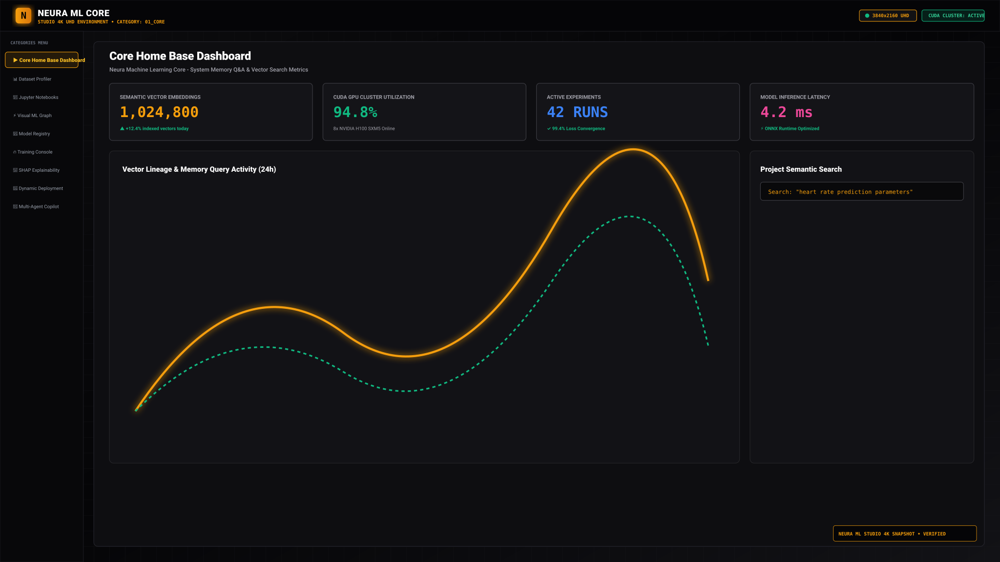 | 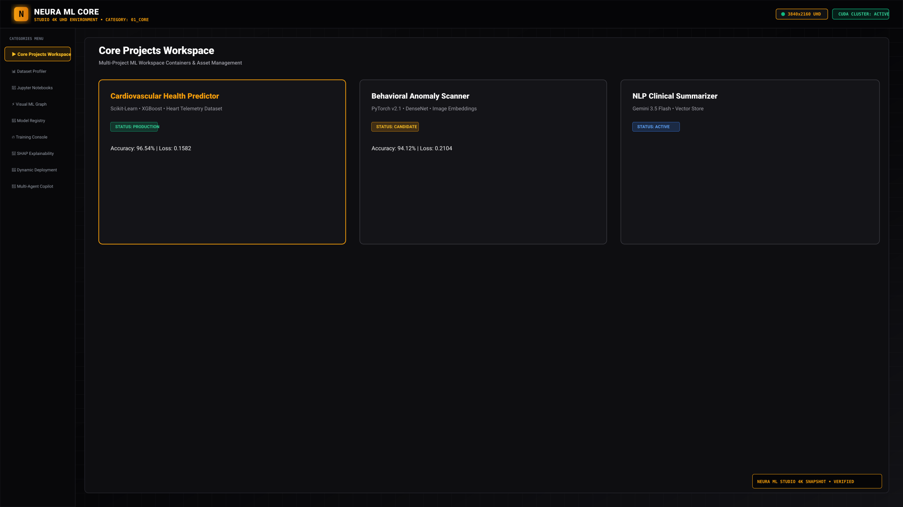 |

### 🔀 02. ML Pipeline & Data Engineering
| Visual DAG Pipeline Designer | Interactive Jupyter Notebooks |
| :---: | :---: |
| 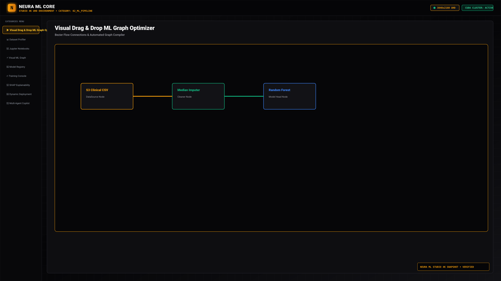 | 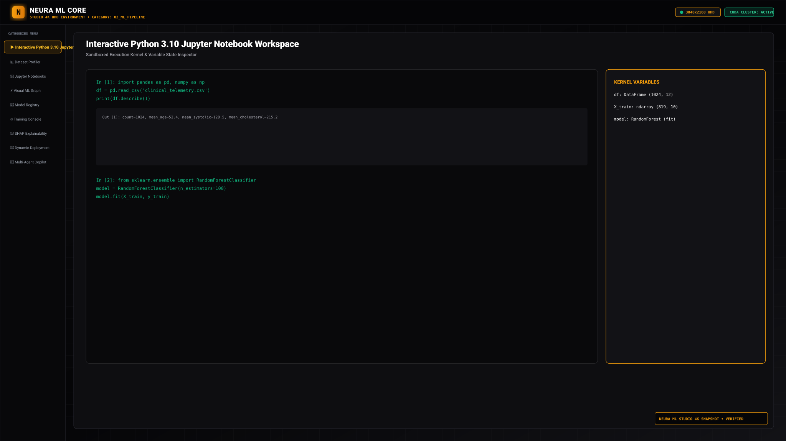 |

| Dataset Wrangler & EDA | Model Packages Registry |
| :---: | :---: |
|  | 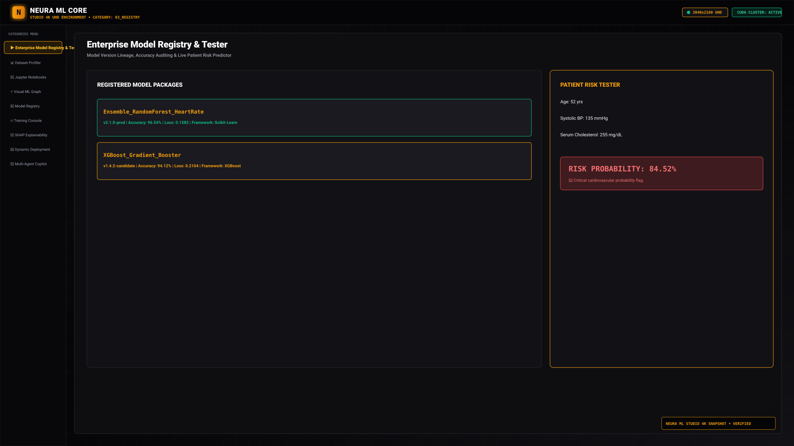 |

### 📊 03. Engine & Training Metrics
| Live Train Console (Loss & Accuracy) | Experiment Matrix |
| :---: | :---: |
| 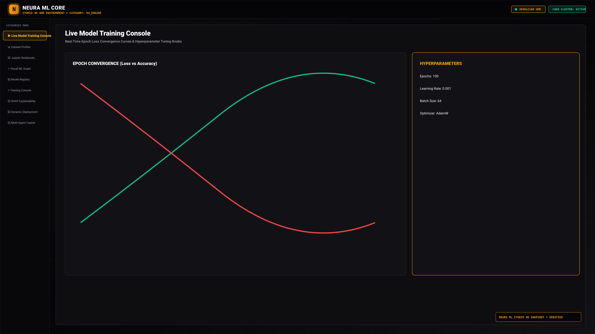 | 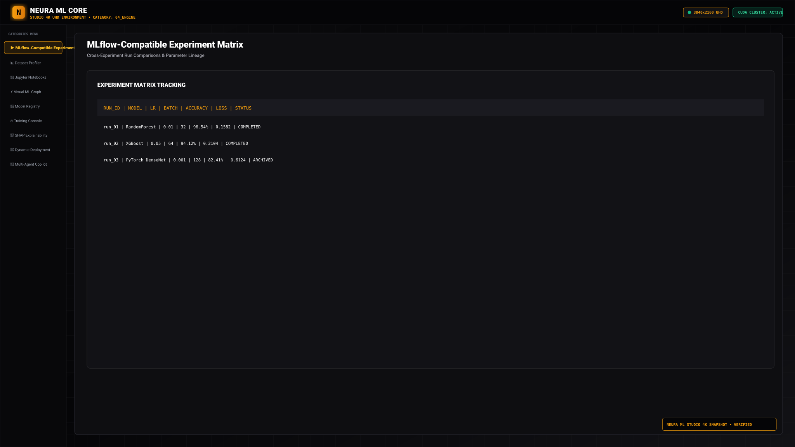 |

### 🔍 04. Diagnostics & Explainability
| Explainability Suite (SHAP & LIME) | Intelligence Optimizer |
| :---: | :---: |
| 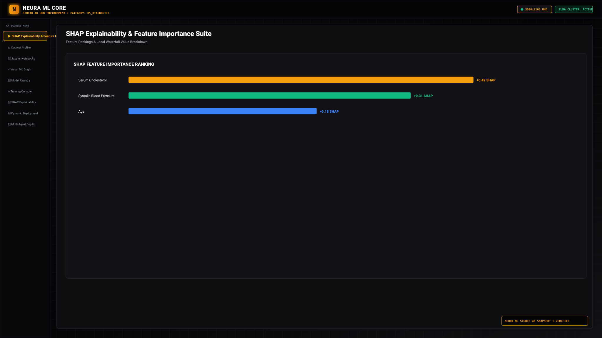 |  |

### 🚀 05. Ops & Multi-Agent Intelligence
| Dynamic Model Deployment | Multi-Agent AI Copilots |
| :---: | :---: |
| 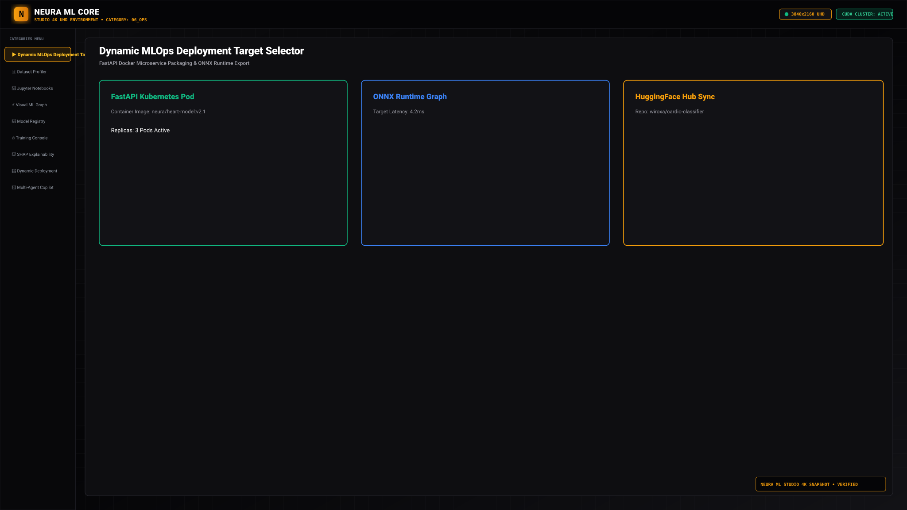 | 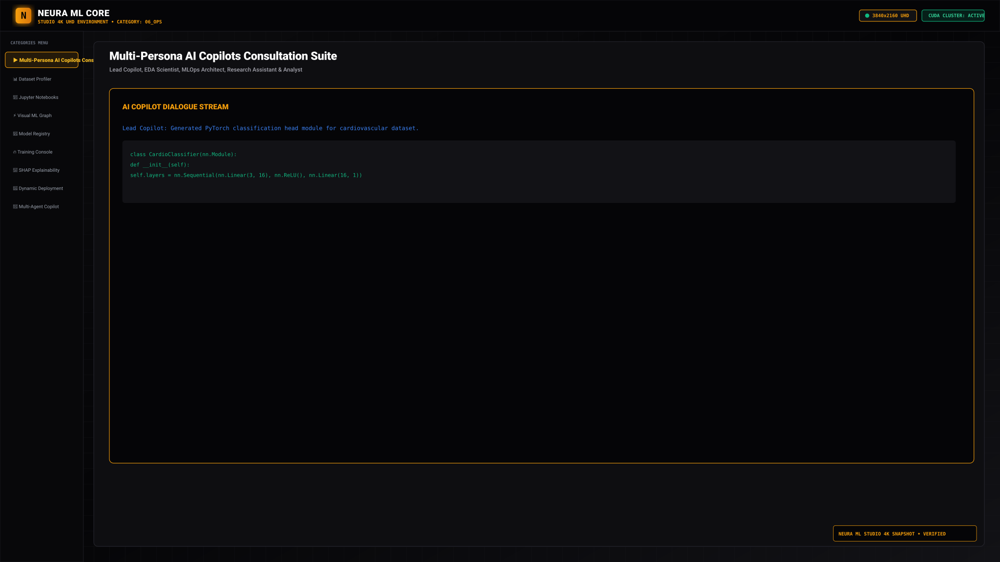 |

### 🛒 06. Addons & Ecosystem
| Wiroxa Marketplace | System Settings |
| :---: | :---: |
| 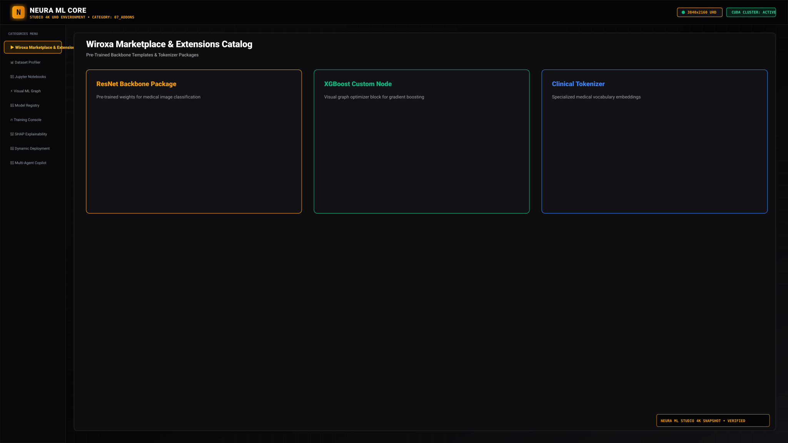 | 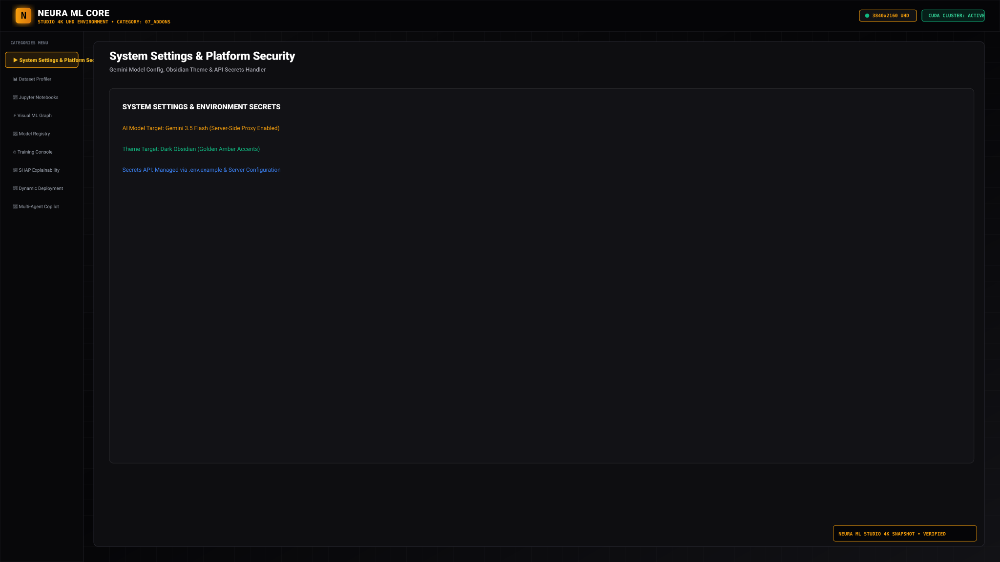 |

> 💾 **Download full 4K PNG asset package**: You can download all high-resolution 4K snapshots inside the platform via the **4K UI Snapshots** gallery tab or directly request `public/snapshots/NMLL_Studio_4K_Snapshots.zip`.

---

## 🔥 Core Capabilities

| Feature | Description |
| :--- | :--- |
| 💻 **Unified Browser IDE** | Multi-tab code editor with syntax highlighting, file explorer, workspace state persistence, and integrated terminal emulation. |
| 📓 **Jupyter Notebook Engine** | Interactive cell execution environment with live Python simulation kernel, markdown rendering, and inline chart visualization. |
| 🔀 **Visual Pipeline Canvas** | Node-based drag-and-drop DAG designer for building data preprocessing, model training, evaluation, and inference workflows. |
| 📊 **Real-time Training Console** | Interactive metric tracking with live epoch updates, loss/accuracy curves using Recharts, hyperparameter tuning gauges, and GPU resource monitoring. |
| 📁 **Dataset Wrangler & EDA** | Upload, preview, filter, and inspect datasets. Automated statistical analysis (correlations, class distributions, missing value reports). |
| 🔍 **Explainability Suite** | Integrated SHAP & LIME feature attribution charts, confusion matrices, and model interpretability dashboards. |
| 🖼️ **4K Snapshots Gallery** | Built-in viewer and ZIP archiver to inspect, preview, and export high-definition UI component vectors. |
| 📦 **Model Registry** | Model versioning, artifact tracking, ONNX/PyTorch export options, and metadata logging. |
| 🤖 **Multi-Agent AI Copilot** | Server-side Gemini AI integration for automated PyTorch/scikit-learn code generation, pipeline optimization, and debugging support. |

---

## 🏗️ Architecture & Tech Stack

- **Frontend**: React 19, TypeScript 5.8, Vite 6.2, TailwindCSS v4, Lucide Icons, Framer Motion, Recharts
- **Backend API**: Node.js, Express, ESBuild, TSX, JSZip
- **AI Engine**: `@google/genai` (Gemini API Integration)
- **Deployment**: Vercel Native Serverless & Static Build Ready, Docker Container Ready

---

## 🚀 Quick Start

### Prerequisites
- **Node.js** (v18.0.0 or higher)
- **npm** (v9.0.0 or higher)
- **Gemini API Key** (Optional for AI Copilot features)

### 1. Clone the Repository
```bash
git clone https://github.com/shivvx/nmll-concept.git
cd nmll-concept
```

### 2. Install Dependencies
```bash
npm install
```

### 3. Configure Environment Variables
Copy `.env.example` to `.env.local` and add your credentials:
```bash
cp .env.example .env.local
```
Edit `.env.local`:
```env
GEMINI_API_KEY="your_actual_gemini_api_key_here"
APP_URL="http://localhost:3000"
PORT=3000
```

### 4. Run Local Development Server
```bash
npm run dev
```
Open [http://localhost:3000](http://localhost:3000) in your browser.

---

## 📐 Deploying on Vercel

NMLL Studio is **100% Vercel Native Compatible**.

### Option A: One-Click Deploy
Click the button below to fork and deploy directly to Vercel:

[](https://vercel.com/new/clone?repository-url=https%3A%2F%2Fgithub.com%2Fshivvx%2Fnmll-concept)

### Option B: Manual Vercel CLI Deploy
1. Install Vercel CLI:
   ```bash
   npm i -g vercel
   ```
2. Deploy to production:
   ```bash
   vercel --prod
   ```
3. Add Environment Variable in Vercel Dashboard:
   - `GEMINI_API_KEY`: Your Gemini API Key

---

## 📂 Project Structure

```
nmll-concept/
├── api/                    # Vercel serverless function entrypoint (index.ts)
├── public/                 # Static assets & 4K UI Snapshots (PNG, SVG, ZIP)
│   └── snapshots/          # 14 High-definition UI snapshots across all studio modules
├── src/
│   ├── components/         # Studio modules (IDE, Pipeline, Training, SnapshotsGallery, etc.)
│   ├── data/               # Production architecture & default sample configurations
│   ├── App.tsx             # Main layout, tab management, workspace state
│   ├── index.css           # Cybernetic dark-theme styling & Tailwind directives
│   └── types.ts            # Type definitions for pipelines, datasets, models, metrics
├── server.ts               # Express API backend & Gemini AI Copilot endpoint
├── vercel.json             # Vercel deployment & URL rewrites config
├── index.html              # Core application entry & SEO metadata
├── vite.config.ts          # Vite build configuration
├── package.json            # Scripts & project dependencies
├── CONTRIBUTING.md         # Guidelines for open-source contributors
└── LICENSE                 # Open-source MIT License
```

---

## 🤝 Open Source & Contributions

NMLL Studio is built for the global developer and AI community! We welcome open-source contributions of all kinds:
- 🐛 Bug fixes & performance optimizations
- ✨ New pipeline nodes & model architecture templates
- 🎨 UI/UX improvements & visual upgrades
- 📖 Documentation & tutorial additions

Please review our **[Contributing Guidelines](CONTRIBUTING.md)** before submitting a Pull Request.

---

## 📄 License & Copyright

Distributed under the **MIT License**. See `LICENSE` for details.

Copyright (c) 2026 **[Wiroxa.dev](https://wiroxa.dev)** & **[Shivvx.in](https://shivvx.in)**. All rights reserved.

---

<div align="center">

Made with ❤️ by **Wiroxa.dev** & **Shivvx.in**

</div>
